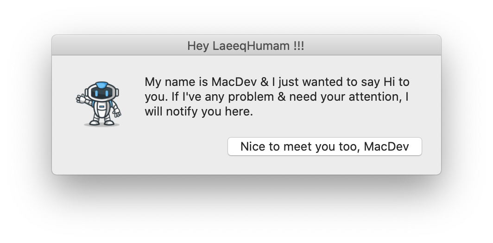
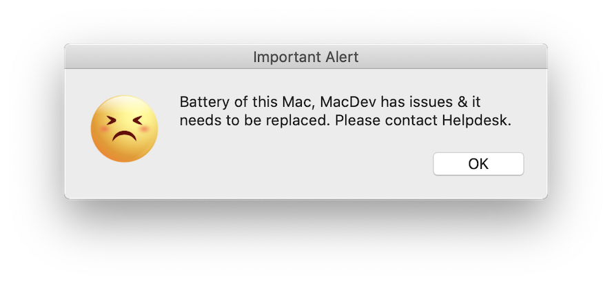
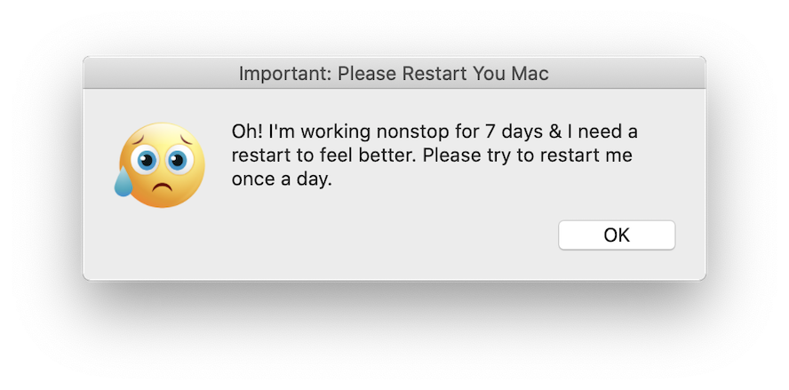
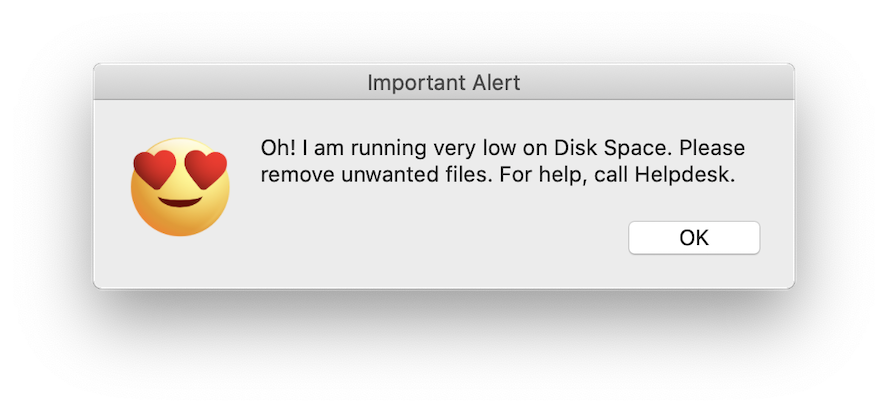

This is a quick solution to run a health check once a week. In the world of emojis & gifs, things have started making more sense to the users when it has one. 
The entire solution has lots of moving parts & it's completely modular. This is meant to inform users about the issues the Mac is facing & they are not aware of. 
v1.0 has the following:

-  An Introduction popup to inform users that Mac will send the notification if it has issues. It will grep the UserName & Machine name & customise the popup just for the logged in user.

-  1. Notify users if Macs hasn't rebooted for more than 3 days
-  2. Notify users if Hard Disk has less than 15GB free space
-  3. Notify users if Battery needs replacement

** _Features to be added in v2.0_ **
1. Check & fix proxy
2. Check & fix time server

**How to install locally for testing:**
Download the ROOT folder.
Consider ROOT as the same ROOT you use while running a pkgutil command.
In simpler words, expand the folder & keep the files as the absolute path. 
You won't have HealthCheck folder on your Mac, obviously. Create a folder & then keep the contents.

**Best Practice to deploy for users:**
-  Check permissions
-  Test it locally by running the HealthCheckEngine.sh manually 
-  Test multiple times.
-  Modify the LaunchAgent to run every 15mins & test.
-  Ensure that it works.
-  Make changes you need.
-  Test on 2-3 Macs with a frequency of Daily.
-  Now create the package & deploy in Production.

Folder structure where the files should be placed, will be added soon.
